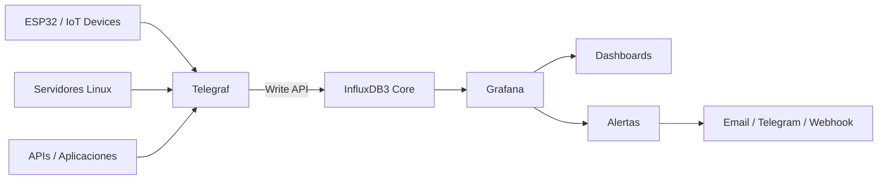

# Modern TIG Stack for InfluxDB 3

Con estas 3 tecnologias seremos capaces de recolectar, almacenar y analizar informacion en tiempo real para casi cualquier servicio, API, dispositivos IoT, etc.

1. **Telegraf** Recolecta la metricas del sistema donde esta ejecutandose y las escribe en la base de datos influxdb.
2. **InfluxDB 3** (Core o Enterprise) es una base de datos para series de tiempos.
3. **Grafana** Es una herramienta de visualizacion de datos (Dashboard) que grafica las metricas de las bases de datos como influxdb desde sus tablas.



## Pre-requisitos:

1. Docker instalado en la maquina. y el plugin de docker compose [docker-compose.yaml](docker-compose.yml) con este archivo configuraremos e instalaremos los 3 contenedores a utilizar, Telegraf, InfluxDB 3 Core/Enteprise y Grafana.
2. Git para control de versiones (opcional)
3. Un editor (vscode)

# Pasos:

## 1. Clonar el repositorio

```sh
git clone https://github.com/socrateslugo/soky-tig
cd soky-tig
```

## 2. Iniciar InfluxDB 3

InfluxDB 3 Core & Generar el Token

```sh
docker compose up -d influxdb3-core
docker compose exec influxdb3-core influxdb3 create token --admin
```

## 3. Actualizar el archivo .env

Abrir el archivo [.env](.env) y pegar el token generado en la variable "INFLUXDB_TOKEN".

## 4. Iniciar los servicios (docker) faltantes (telegraf y grafana)

```sh
docker compose up -d telegraf
docker compose up -d grafana
```

## 5. Verificar los logs

```sh
# Verifica los losgs
docker compose logs telegraf

# Verificar los logs de InfluxDB 3 y ver las tablas de telegraf generadas
docker compose logs influxdb3-core
docker compose exec influxdb3-core influxdb3 query "SHOW TABLES" --database local_system --token REPLACE_WITH_YOUR_TOKEN_STRING
```

## 6. Configurar la fuente en Grafana y su Dashboard

- Abrir desde su navegador localhost:3000
- Accesar con las credenciales que utilizamos en el archivo .env (default: admin/admin)
- Agregar Data Source :
  - Type: InfluxDB
  - Language : SQL
  - Database: pegar el nombre de la base de datos de INFLUXDB_BUCKET que esta en el archivo .env
  - URL: http://influxdb3-core:8181 para conectarse a InfluxDB 3 Core
  - URL: http://influxdb3-enterprise:8181 para conectarse a InfluxDB 3 Enterprise
  - Dataabse: Encontrar el nombre dentro de el archivo .env (bucker name es el nombre de la base de datos)
  - Token: Pegar la cadena de la variable INFLUXDB_TOKEN que esta en el archivo .env y poner a true **Insecure Connection to ON**
- Agregar Data Visualization : Dashboards > Create Dashboard - Add Visualization > Select Data Source > InfluxDB_3_Core
- En el query 'builder' pegar y ejecutar el siguiente codigo SQL para ver los datos recolectados via Telegraf, y escritos en InfluxDB 3.

```sql
SELECT "cpu", "usage_user", "time" FROM "cpu" WHERE "time" >= $__timeFrom AND "time" <= $__timeTo AND "cpu" = 'cpu0'
```

## 7. Detener los contenedores y eliminar sus datos

### Detener los Servicios (contenedores)

```sh
docker compose down
```

### Detener y eliminar sus volumenes (Destruye todos sus datos)

```sh
docker compose down -v
```
